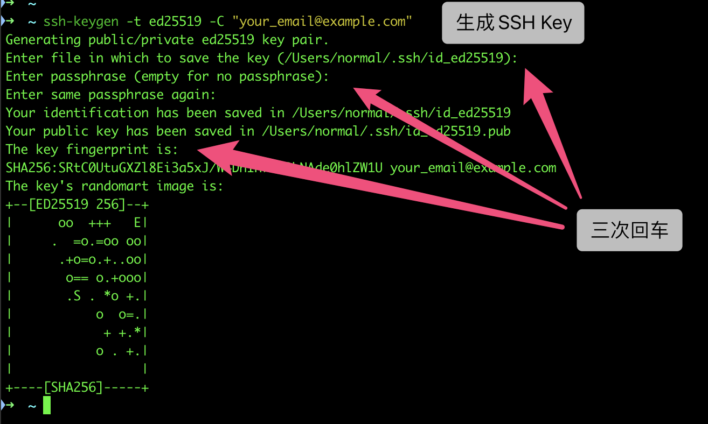
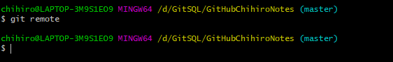
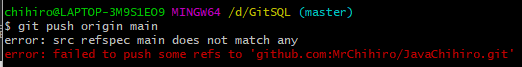

# :butterfly:千寻简Git连接GitHub

## :notebook_with_decorative_cover: 笔记介绍

大家好，这里是千寻简笔记，我是作者星辰，笔记内容整理并发布，内容有误请指出，笔记源码已开源，前往Gitee搜索《**[chihiro-notes](https://gitee.com/opxc/chihiro-notes)**》感谢您的观看

作者各大平台直链： [GitHub](https://github.com/MrChihiro) | [Gitee](https://gitee.com/opxc) | [CSDN](https://blog.csdn.net/IUTStar) 

## :bookmark_tabs: 目录

[TOC]

## :man_student:正文

### :a:本地操作

#### :one:生成/添加SSH公钥

在用户主目录下，看看有没有.ssh目录，如果有，再看看这个目录下有没有`id_rsa`和`id_rsa.pub`这两个文件，如果有的话，直接跳过此如下命令，如果没有的话，打开命令行，输入如下命令：

```shell
ssh-keygen -t ed25519 -C "xxxxx@xxxxx.com"  
# Generating public/private ed25519 key pair...
```

>注意：这里的 xxxxx@xxxxx.com 只是生成的 sshkey 的名称，并不约束或要求具体命名为某个邮箱。
>
>现网的大部分教程均讲解的使用邮箱生成，其一开始的初衷仅仅是为了便于辨识所以使用了邮箱。

按照提示完成三次回车，即可生成 ssh key。

通过查看 `~/.ssh/id_ed25519.pub` 文件内容，获取到你的 public key。Windows在`C:\Users\当前用户\.ssh\ `文件夹里。

```
cat ~/.ssh/id_ed25519.pub
# ssh-ed25519 AAAAB3NzaC1yc2EAAAADAQABAAABAQC6eNtGpNGwstc....
```


#### :two:复制公钥到GitHub

打开GitHub：https://github.com/settings/keys

点击：new SSH Key


#### :three:添加SSH Key

填上Title（随意写），在Key文本框里粘贴 `id_rsa.pub`文件里的全部内容，点击Add SSH key即可。


#### :four:本地验证是否成功

验证是否成功，在`git bash`里输入下面的命令

```shell
$ ssh -T git@github.com
```

如果初次设置的话，会出现如下界面，输入yes 同意即可


#### :five:设置名称和邮箱

设置`username`和`email`，因为GitHub每次`commit`都会记录他们。

```shell
$ git config --global user.name  "name"//你的GitHub登陆名
$ git config --global user.email "123@126.com"//你的GitHub注册邮箱
```

#### :six:连接仓库

`git`工具使用以下命令，看是否有没有远程仓库源。

```shell
git remote      //--git查看远程仓库信息
```


> 出现以上错误就是改文件夹没有 `git init` 他不是一个仓库文件夹.

```shell
git init		//--初始化本地仓库
```


> 这个时候本地的文件夹就多了一个`.git`文件。

这个时候我们在来输入测试一下， 没有任何显示就是没有仓库信息。

```shell
git remote      //--git查看远程仓库信息
```



我们去复制一下仓库信息：https://github.com/MrChihiro/chihiro-notes


添加仓库信息：

```shell
git remote add origin git@github.com:MrChihiro/chihiro-notes.git
```


 这样我们就已经连接到了，可以看看，输入以下命令

```shell
git remote -v
```


#### :seven:拉取和更新

```shell
$ git pull origin main
```


合并完后将代码push到git上


这个时候，我们会发现这里报了一个错误`错误：src refspec main 不匹配任何`

**错误产生的原因：Github 工程默认名为了 main**

```java
由于受到"Black Lives Matter"运动的影响，GitHub 从今年 10 月 1 日起，在该平台上创建的所有新的源代码仓库将默认被命名为 “main”，而不是原先的"master"。
```


push 报错



**解决方案1：**

官方给了提示 git branch -M main。但在执行时报错：

```shell
error: refname refs/heads/master not found
fatal: Branch rename failed
```

原因在于 你本地暂没发现 master 分支。

```shell
git branch -M main
```

是一个改名操作，所以本地要保证先有 master 分支。那就在本地先执行完基本的操作：初始化、add 、commit 之后，再 执行更名操作。


这里就成功的把本地的master更改为main。


更改完成后我们去push，成功提交到Gitee中。

```shell
$ git push -u origin main
```


#### :eight: 常用的命令

参考文献：[Git操作流程（非常详细）](https://blog.csdn.net/qq_44417271/article/details/119108373?ops_request_misc=%257B%2522request%255Fid%2522%253A%2522165640750216781435454323%2522%252C%2522scm%2522%253A%252220140713.130102334..%2522%257D&request_id=165640750216781435454323&biz_id=0&utm_medium=distribute.pc_search_result.none-task-blog-2~all~top_click~default-1-119108373-null-null.142^v24^huaweicloudv2,157^v15^new_3&utm_term=git%E6%93%8D%E4%BD%9C&spm=1018.2226.3001.4187)

**查看远程仓库信息**

```shell
#查看远程仓库信息
$ git remote
origin


$ git remote -v
origin  git@gitee.com:opxc/chihiro-notes.git (fetch)
origin  git@gitee.com:opxc/chihiro-notes.git (push)
```

**初始化仓库**

```shell
//初始化仓库
$ git init
Reinitialized existing Git repository in D:/GitSQL/gitee-chihiro-notes/.git/
```

**查看分支名称**

```shell
$ git branch
* main
```

**同步一下仓库**

```shell
git fetch
```

**拉取代码与线下的git代码合并**

```shell
git pull origin main
```

**更新分支代码并提交**

```shell
git add .
```

**添加注释**

```shell
git commit -m “添加注释”
```

**合并完后将代码push到git上**

```shell
git push -u origin main
```

**报错：**

```
chihiro@LAPTOP-3M9S1EO9 MINGW64 /d/GitSQL/GiteeChihiroNotes (main)
$ git push origin main
To gitee.com:opxc/chihiro-notes.git
 ! [rejected]        main -> main (fetch first)
error: failed to push some refs to 'gitee.com:opxc/chihiro-notes.git'
hint: Updates were rejected because the remote contains work that you do
hint: not have locally. This is usually caused by another repository pushing
hint: to the same ref. You may want to first integrate the remote changes
hint: (e.g., 'git pull ...') before pushing again.
hint: See the 'Note about fast-forwards' in 'git push --help' for details.
```


