# 千寻简Git连接Gitee

## 介绍

大家好，这里是千寻简笔记，我是作者星辰，笔记内容整理并发布，内容有误请指出，笔记源码已开源，前往Gitee搜索《**[chihiro-notes](https://gitee.com/opxc/chihiro-notes)**》感谢您的观看！如果对你有帮助，请帮忙点一下赞叭~

作者各大平台直链： [GitHub](https://github.com/MrChihiro) | [Gitee](https://gitee.com/opxc) | [CSDN](https://blog.csdn.net/IUTStar) 

## 目录

[TOC]

## 正文

### 第一步：打开：https://gitee.com/

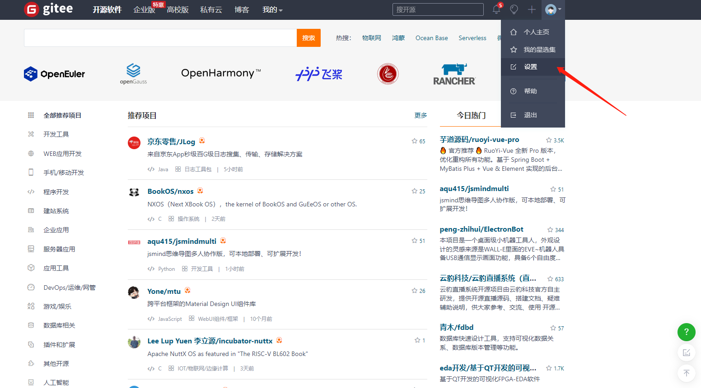

### 第二步：添加个人公钥

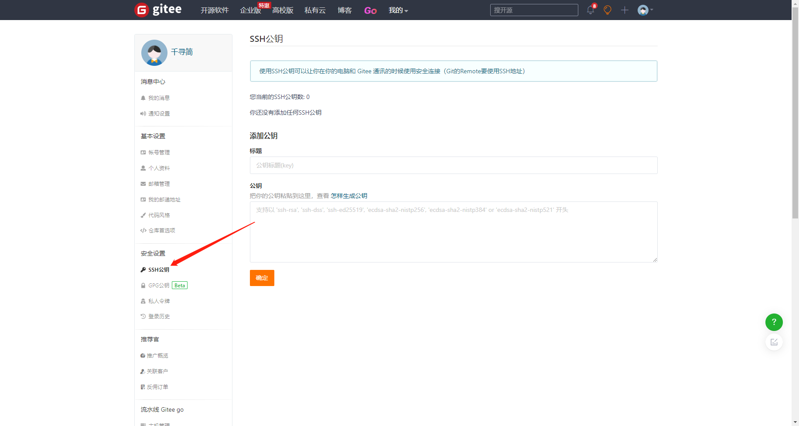

### 第三步：生成/添加SSH公钥

在用户主目录下，看看有没有.ssh目录，如果有，再看看这个目录下有没有`id_rsa`和`id_rsa.pub`这两个文件，如果有的话，直接跳过此如下命令，如果没有的话，打开命令行，输入如下命令：

```shell
ssh-keygen -t ed25519 -C "xxxxx@xxxxx.com"  
# Generating public/private ed25519 key pair...
```

>注意：这里的 xxxxx@xxxxx.com 只是生成的 sshkey 的名称，并不约束或要求具体命名为某个邮箱。
>
>现网的大部分教程均讲解的使用邮箱生成，其一开始的初衷仅仅是为了便于辨识所以使用了邮箱。

按照提示完成三次回车，即可生成 ssh key。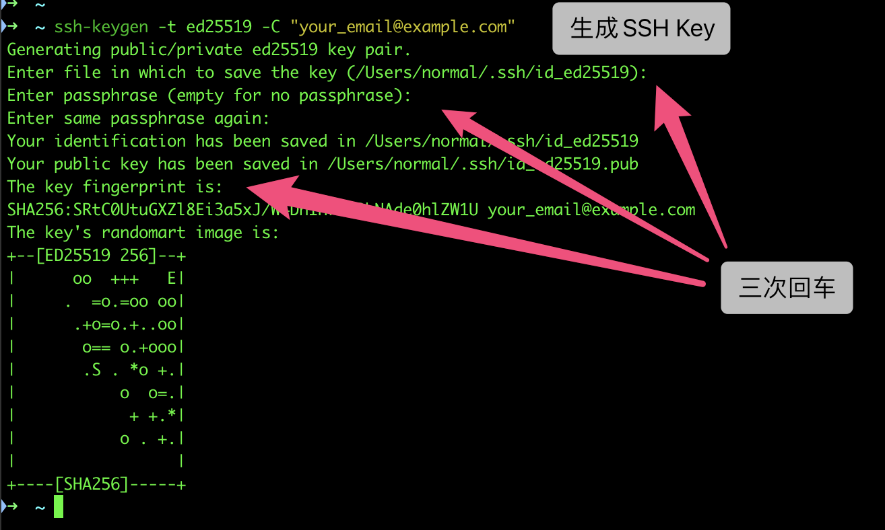

通过查看 `~/.ssh/id_ed25519.pub` 文件内容，获取到你的 public key。Windows在`C:\Users\当前用户\.ssh\ `文件夹里。

```
cat ~/.ssh/id_ed25519.pub
# ssh-ed25519 AAAAB3NzaC1yc2EAAAADAQABAAABAQC6eNtGpNGwstc....
```

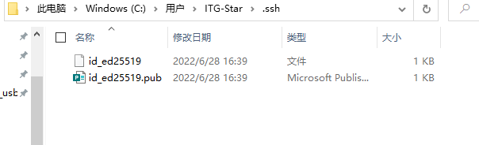


### 第四步：把公钥复制到Gitee

复制后点击确定，进行账号安全验证即可

> 注意：使用SSH公钥可以让你在你的电脑和 Gitee 通讯的时候使用安全连接（Git的Remote要使用SSH地址）

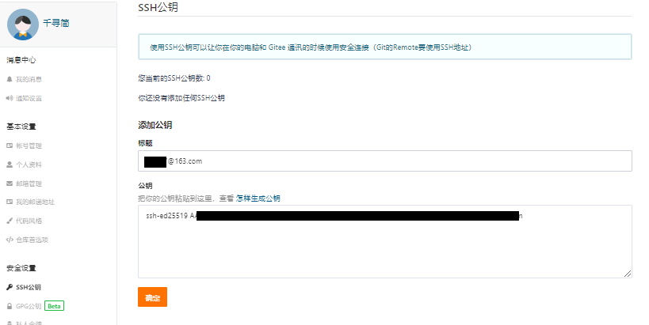


### 第五步：本地操作

git工具使用以下命令，看是否有没有远程 仓库源

```shell
git remote      //--git查看远程仓库信息
```

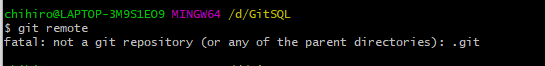

出现以上错误就是改文件夹没有 git init 他不是一个仓库文件夹

```shell
git init		//--初始化本地仓库
```

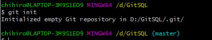

这个时候本地的文件夹就多了一个`.git`文件


这个时候我们在来输入测试一下

```shell
git remote      //--git查看远程仓库信息
```

 没有任何显示就是没有仓库信息

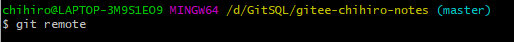

 我们去复制一下仓库信息

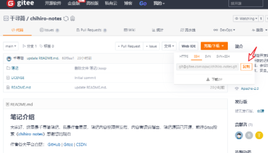

添加仓库信息：

```
git remote add origin git@gitee.com:opxc/chihiro-notes.git
```

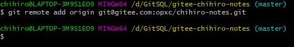

 这样我们就已经连接到了，可以看看，输入以下命令

```
git remote -v
```

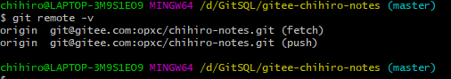

### 第六步：拉取和更新

#### 拉取代码与线下的git代码合并

```shell
$ git pull origin main
remote: Enumerating objects: 30, done.
remote: Counting objects: 100% (3/3), done.
remote: Compressing objects: 100% (3/3), done.
remote: Total 30 (delta 0), reused 0 (delta 0), pack-reused 27
Unpacking objects: 100% (30/30), 11.08 MiB | 2.20 MiB/s, done.
From gitee.com:opxc/chihiro-notes
 * branch            main       -> FETCH_HEAD
 * [new branch]      main       -> origin/main
```

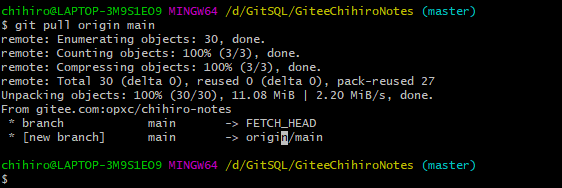

#### 合并完后将代码push到git上

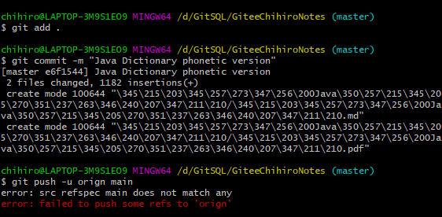

这个时候，我们会发现这里报了一个错误`错误：src refspec main 不匹配任何`

**错误产生的原因：Github 工程默认名为了 main**

```java
由于受到"Black Lives Matter"运动的影响，GitHub 从今年 10 月 1 日起，在该平台上创建的所有新的源代码仓库将默认被命名为 “main”，而不是原先的"master"。
```

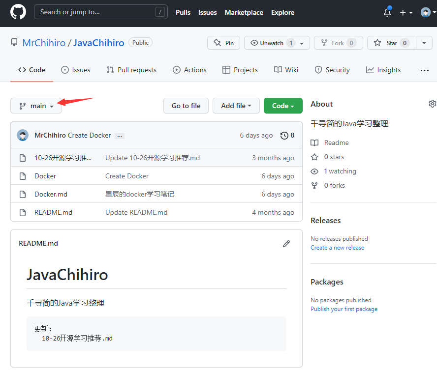

push 报错

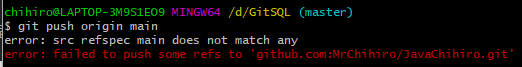

**解决方案1：**

官方给了提示 git branch -M main。但在执行时报错：

```
error: refname refs/heads/master not found
fatal: Branch rename failed
```

原因在于 你本地暂没发现 master 分支。

```
git branch -M main
```

是一个改名操作，所以本地要保证先有 master 分支。那就在本地先执行完基本的操作：初始化、add 、commit 之后，再 执行更名操作。

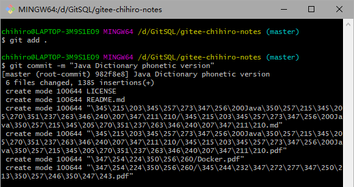

这里就成功的把本地的master更改为main。

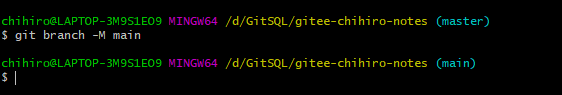

更改完成后我们去push，成功提交到Gitee中。

```shell
$ git push -u origin main

Enumerating objects: 6, done.
Counting objects: 100% (6/6), done.
Delta compression using up to 8 threads
Compressing objects: 100% (5/5), done.
Writing objects: 100% (5/5), 720.51 KiB | 17.15 MiB/s, done.
Total 5 (delta 0), reused 0 (delta 0), pack-reused 0
remote: Powered by GITEE.COM [GNK-6.3]
To gitee.com:opxc/chihiro-notes.git
   60f9aa1..e6f1544  main -> main
Branch 'main' set up to track remote branch 'main' from 'origin'.
```

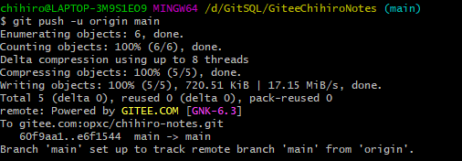

### 第七步：常用的命令

参考文献：[Git操作流程（非常详细）](https://blog.csdn.net/qq_44417271/article/details/119108373?ops_request_misc=%257B%2522request%255Fid%2522%253A%2522165640750216781435454323%2522%252C%2522scm%2522%253A%252220140713.130102334..%2522%257D&request_id=165640750216781435454323&biz_id=0&utm_medium=distribute.pc_search_result.none-task-blog-2~all~top_click~default-1-119108373-null-null.142^v24^huaweicloudv2,157^v15^new_3&utm_term=git%E6%93%8D%E4%BD%9C&spm=1018.2226.3001.4187)

#### 查看远程仓库信息

```shell
#查看远程仓库信息
$ git remote
origin


$ git remote -v
origin  git@gitee.com:opxc/chihiro-notes.git (fetch)
origin  git@gitee.com:opxc/chihiro-notes.git (push)
```

#### 初始化仓库

```shell
//初始化仓库
$ git init
Reinitialized existing Git repository in D:/GitSQL/gitee-chihiro-notes/.git/
```

#### 查看分支名称

```shell
$ git branch
* main
```

#### 同步一下仓库

```shell
git fetch
```

#### 拉取代码与线下的git代码合并

```shell
git pull origin main
```

#### 合并完后将代码push到git上

```shell
git push -u origin main
```

### 扩展：部署公钥

>部署公钥允许以只读的方式访问仓库，主要用于仓库在生产服务器的部署上，免去HTTP方式每次操作都要输入密码和普通SSH方式担心不小心修改仓库代码的麻烦。

部署公钥配置后的机器，只支持clone与pull等只读操作。如果您想要对仓库进行写操作，请 [添加个人公钥](https://gitee.com/profile/sshkeys)

复制生成后的 ssh key，通过仓库主页 **「管理」->「部署公钥管理」->「添加部署公钥」** ，添加生成的 public key 添加到仓库中。


添加后，在终端（Terminal）中输入

```
ssh -T git@gitee.com
```

首次使用需要确认并添加主机到本机SSH可信列表。若返回 `Hi XXX! You've successfully authenticated, but Gitee.com does not provide shell access.` 内容，则证明添加成功。


添加成功后，就可以使用SSH协议对仓库进行操作了。

### 仓库公钥和可部署公钥

为了便于用户在多个项目仓库下使用一套公钥，免于重复部署和管理的繁琐，Gitee 推出了「可部署公钥」功能，支持在一个仓库空间下使用当前账户名下/参与的另一个仓库空间的部署公钥，实现公钥共用。

